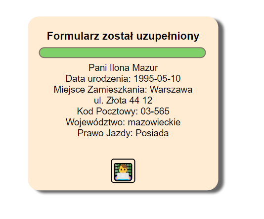

## Web-Development
#### Projekt Strony internetowej, wykonany za pomocą różnych technologii na rzecz przedmiotu: 
#### ,,Budowa Serwisów Internetowych" na studiach inżynierskich.
###
#### http://alexwzim.cba.pl/
#### Login: Aleksander 
#### Password: Lewicki 
-------------------------------------------------------------
## Wykorzystane technologie w poszczególnych projektach:
#### Tabela Tekstu (Pierwszy projekt, Podział tekstu na stronie z wykorzystaniem tabeli w html'u: tr, th)

PHP, HTML, CSS

#### Galeria Zdjęć (Umiejscowienie zdjęć na stronie za pomocą tabeli w html'u: tr, td)

PHP, HTML, CSS

#### Formularz Kontaktowy (Formularz kontaktowy napisany w czystym html'u)

PHP, HTML

#### Tabela Tekstu [div + css] (Podział tekstu na stronie za pomocą div'ów)

PHP, HTML, CSS

#### Galeria Zdjęć [div + css] (Rozmieszczenie fotografii na stronie za pomocą div'ów)

PHP, HTML, CSS

#### Formularz Kontaktowy [div + css] (Formularz Kontaktowy uzupełniony o szatę graficzną z CSS'a)

PHP, HTML, CSS

#### Faktura (Faktura podliczająca automatycznie Wartość z VAT, Kwotę VAT i Wartość netto)

PHP, XML, XSLT, CSS, HTML

#### Kalkulator (Kalkulator wykonany w JS, wykonujący podstawowe działania matematyczne)

PHP, HTML, CSS, JS

#### Formularz [Regular Expression] (Formularz Kontaktowy, który weryfikuje wpisane frazy)

PHP, HTML, CSS, JS, Regular expression

#### Formularz PHP (Formularz zwracający wiadomość, która zawiera wcześniej wpisane przez nas dane)

PHP, HTML, CSS, JS

#### Logowanie PHP (Logowanie na stronie pozwalające dostać się do pozostałych projektów. W każdym projekcie możliwość wylogowania skutkuje brakiem możliwości cofnięcia się do poprzednich dokumentów. Zasada działania "Session Value". Jeżeli login i hasło nie zgadzają się, sesja zostaje usunięta, podobnie jak przy wylogowaniu)

PHP, HTML, CSS,

#### Baza (Kalkulator wykonany w JS, wykonujący podstawowe działania matematyczne)

PHP, HTML, CSS, phpMyAdmin

